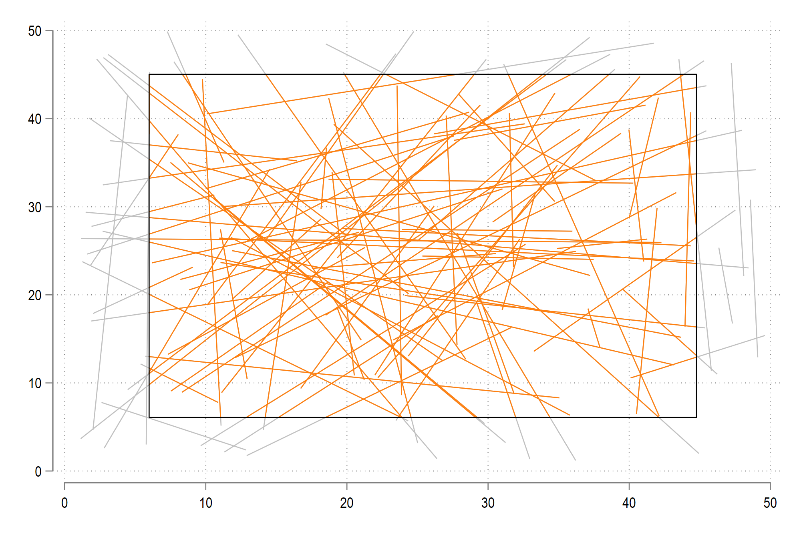
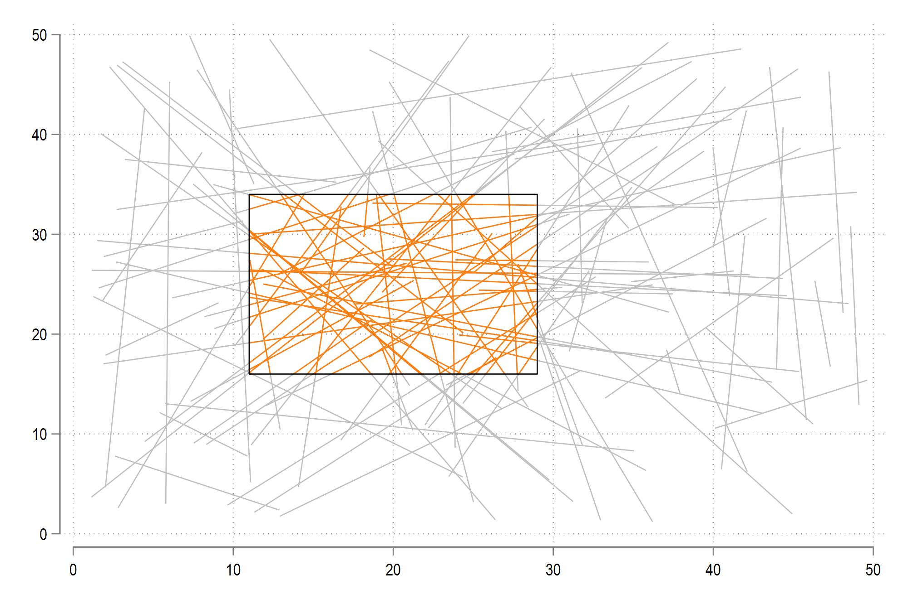

# clipline

This package implements the Cohen-Sutherland line clipping algorithm in Stata. This is an intermediate program to help support clipping in various applications especially when dealing with spatial data.


*Note:* This is a beta release and still needs to be improved. It has been uploaded here for testing purposes only.


You can install the program as follows:

```applescript
net install clipline, from("https://raw.githubusercontent.com/asjadnaqvi/stata-clipline/main/installation/") replace
```

and then check:

```applescript
help clipline
```

for options. The required syntax is as follows:

```applescript
clipline x1 y1 x2 y2, [box(x_low xhigh y_low y_high)] [offset(number)] [lines] [box]
```


Here is a test code, which is also provided in the dofile above:

```applescript
clear
set obs 100


// generate random lines
gen id = _n
gen x1 = runiform(1,50)
gen y1 = runiform(1,50)
gen x2 = runiform(1,50)
gen y2 = runiform(1,50)
```

You can use a 10% extent (default) option to generate the line clippings:

```applescript
clipline x1 y1 x2 y2, lines addbox
```

The option `lines` adds the information on the lines back to Stata. The option `addbox` adds the box bounds back to Stata. Both are specified for drawing the box:

```applescript
	twoway ///
		(pcspike y1 x1 y2 x2, lw(thin) lc(gs12)) ///
		(pcspike clip_y1 clip_x1 clip_y2 clip_x2, lw(thin)) ///
		(line box_y box_x, lc(black) lw(thin)) ///
			, legend(off) 
```




You can also specify your own box and clipping extent:


```applescript
clipline x1 y1 x2 y2, box(5 35 10 40) offset(-0.2) lines addbox
```

Here we define a custom box bounds and then reduce its size by 20%.

```applescript
	twoway ///
		(pcspike y1 x1 y2 x2, lw(thin) lc(gs12)) ///
		(pcspike clip_y1 clip_x1 clip_y2 clip_x2, lw(thin)) ///
		(line box_y box_x, lc(black) lw(thin)) ///
			, legend(off) 
```




